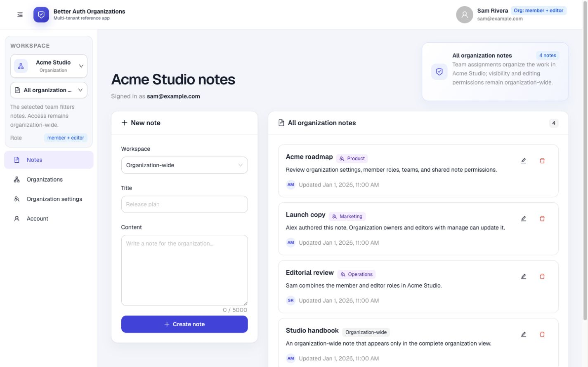
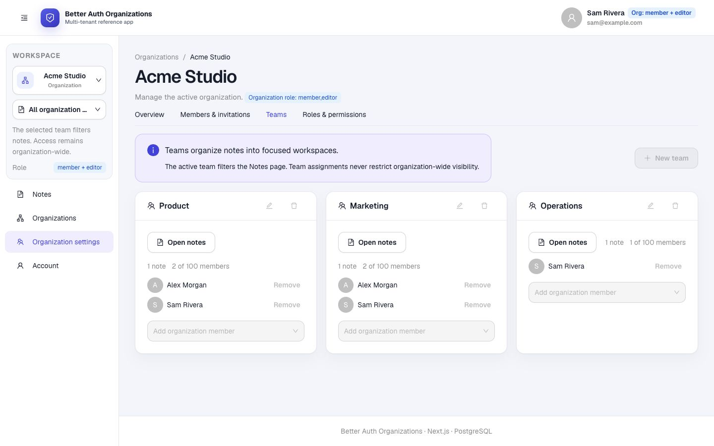
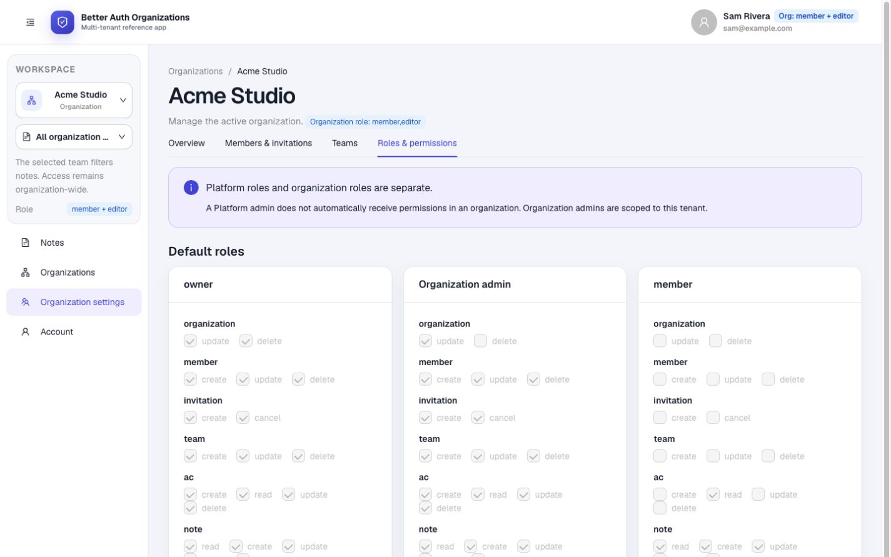
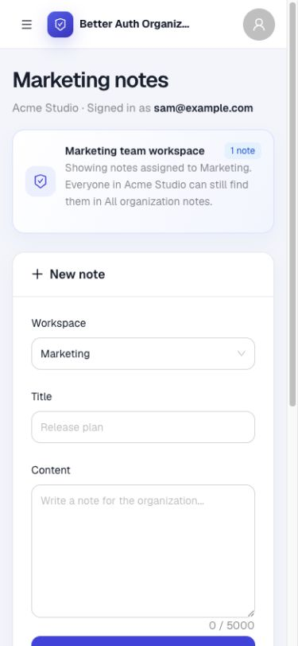
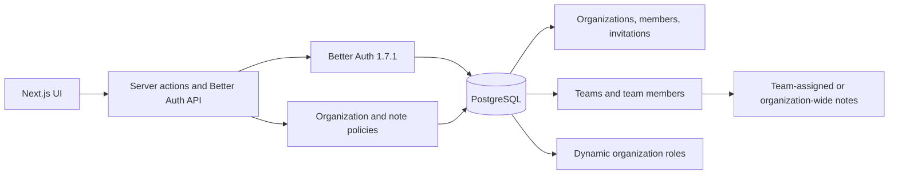
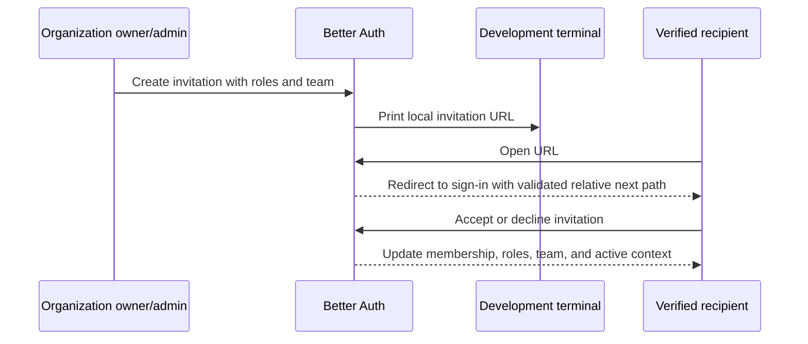

# Better Auth Organizations Demo

A production-minded reference application for [Better Auth](https://www.better-auth.com/) 1.7.1, Next.js 16, Drizzle ORM, and PostgreSQL. It demonstrates authentication, passkeys, multi-tenant organizations, teams, invitations, dynamic roles, and organization-scoped data.

The application is intentionally small enough to explore, while keeping the important security boundaries on the server.

## Screenshots

The screenshots use the seeded Acme Studio scenario and the Sam Rivera account, which combines the standard `member` role with the dynamic `editor` role.

### Organization-wide notes

[](docs/screenshots/notes-workspaces.jpg)

<table>
  <tr>
    <th width="50%">Team workspaces</th>
    <th width="50%">Roles and permissions</th>
  </tr>
  <tr>
    <td><a href="docs/screenshots/team-management.jpg"></a></td>
    <td><a href="docs/screenshots/roles-and-permissions.jpg"></a></td>
  </tr>
</table>

<p align="center">
  <strong>Responsive team workspace</strong><br><br>
  <a href="docs/screenshots/mobile-team-workspace.jpg"></a>
</p>

Screenshot states and refresh guidance are documented in [`docs/screenshots`](docs/screenshots/README.md).

## What is included

| Area | Demonstrated behavior |
| --- | --- |
| Authentication | Password, email OTP, magic link, and discoverable WebAuthn passkeys |
| Organizations | Create, select, update, leave, and delete organizations |
| Members | Multiple organization roles, protected owner changes, removal, and limits |
| Invitations | Verified recipients, 48-hour expiry, multiple roles, initial team, resend, cancel, accept, and decline |
| Teams | Active workspaces, note filtering, membership management, note counts, and deletion guards |
| Access control | Default roles plus up to 10 dynamic roles with a complete permission matrix |
| Notes | Organization-wide visibility, optional team assignment, and author-aware update and delete rules |
| Platform administration | A separate global workspace for user management and an explicit cross-organization note override |

## Architecture



The browser never connects to PostgreSQL. Better Auth protects organization mutations and resolves standard, dynamic, and multiple organization roles. Application note actions additionally constrain every query by `organizationId`; a note ID alone is never treated as authorization. Teams are a workflow filter, not another tenant boundary: every organization member can still find every note in **All organization notes**.

## Roles and permissions

Platform roles and organization roles are separate concepts:

- **Platform admin** is the global Better Auth admin role. It uses a separate workspace, does not participate in the seeded organizations, and has an explicit, server-side note override in the platform administration UI.
- **Organization owner**, **Organization admin**, **member**, and dynamic roles apply only inside one organization.
- A Platform admin is not automatically an Organization admin.

| Permission | Owner | Organization admin | Member |
| --- | :---: | :---: | :---: |
| Update organization | ✓ | ✓ | — |
| Delete organization | ✓ | — | — |
| Manage members and invitations | ✓ | ✓ | — |
| Manage teams | ✓ | ✓ | — |
| Manage dynamic roles | ✓ | ✓ | Read only |
| Read and create notes | ✓ | ✓ | ✓ |
| Update and delete own notes | ✓ | ✓ | ✓ |
| Manage notes by other authors | ✓ | ✓ | — |

Dynamic roles use the same complete resource matrix: `organization`, `member`, `invitation`, `team`, `ac`, and the application resource `note`. Multiple roles are combined by Better Auth. A dynamic role that is assigned to a member or used by a pending invitation cannot be renamed or deleted.

## Quick start

### Requirements

- Node.js 20.9 or newer
- pnpm 11
- Docker with Compose

### Setup

1. Install dependencies and create the local environment file:

   ```bash
   pnpm install
   cp .env.example .env.local
   ```

2. Replace `BETTER_AUTH_SECRET` in `.env.local`:

   ```bash
   openssl rand -base64 32
   ```

3. Start PostgreSQL and apply the versioned migrations:

   ```bash
   docker compose up -d
   pnpm db:migrate
   ```

   Docker exposes PostgreSQL on `localhost:5433` by default to avoid conflicts with an existing local PostgreSQL instance. Override `POSTGRES_PORT` and `DATABASE_URL` together if needed.

4. Seed the repeatable organization scenario:

   ```bash
   pnpm db:seed:demo
   ```

5. To show one-click login choices, set `DEMO_MODE=true` in `.env.local`, then start the app:

   ```bash
   pnpm dev
   ```

Open [http://localhost:3000](http://localhost:3000).

## Demo data

All demo accounts use the password `Demo1234!` and have verified email addresses.

| Account | Email | Platform role |
| --- | --- | --- |
| Demo Admin | `admin@example.com` | Platform admin |
| Alex Morgan | `alex@example.com` | User |
| Sam Rivera | `sam@example.com` | User |

| Organization | Scenario |
| --- | --- |
| Acme Studio | Alex is owner, and Sam combines `member` with the dynamic `editor` role. Product, Marketing, and Operations have distinct notes; the Studio handbook is organization-wide. |
| Launch Lab | Alex is owner. Research and Go-to-market have separate workspaces. Sam has a pending invitation with `member` and `reviewer` roles plus the Research team. |

Demo Admin intentionally has no organization membership or organization notes. This keeps global platform administration separate from tenant work. The seed only replaces organizations and notes with known demo IDs and leaves unrelated organizations untouched. During the migration to organization notes, non-demo notes are preserved in one private **Imported notes** organization per affected author, including an owner membership and default team.

### Suggested walkthrough

1. Sign in as Demo Admin and inspect the separate Platform administration workspace. Open users to review their memberships and organization notes.
2. Sign in as Sam, switch between Product, Marketing, and **All organization notes**, then edit a note by another Acme author through the `editor` role's `note.manage` permission.
3. Sign in as Alex, open a team directly from Organization settings, manage Acme Studio, switch to Launch Lab, and compare organization isolation with team filtering.
4. Copy the seeded Launch Lab invitation ID from the database or create a fresh invitation. Open `/invitations/[invitationId]`, then accept it as Sam.
5. Return as Demo Admin and verify that organization and note navigation is absent from the global workspace.

## Invitation flow



Invitation URLs are printed only during development. Production invitation creation is blocked until `sendInvitationEmail` is connected to a real email provider. External `next` redirects and ambiguous URL forms are rejected.

## Security boundaries

- Every organization note query includes the active `organizationId`.
- A note may reference only a team from its own organization. The active team filters the Notes page, while a cleared team context shows all organization notes.
- Platform admins cannot create organizations and are routed to their separate global workspace; global note access remains an explicit server-side override.
- Members need `note.update` or `note.delete` for their own notes; `note.manage` is required for another author's note.
- The last owner cannot be removed or demoted. Only an owner can assign or change the owner role.
- Every organization receives a default team. The last team and any currently active team are protected from deletion. Deleting another team makes its notes organization-wide instead of deleting them.
- Invitation acceptance and rejection require the matching, verified email account.
- Organizations are limited to 5 per user, 100 members, 50 pending invitations, and 10 teams. Teams are limited to 100 members. Dynamic roles are limited to 10.
- Demo seeding refuses non-local databases unless `DEMO_SEED_ALLOW_REMOTE=true` is explicitly set.
- Passkeys require `http://localhost` in local development and HTTPS in production. `BETTER_AUTH_URL` must match the browser origin exactly.

## Project structure

```text
src/
├── app/                    # App Router pages, Better Auth API, and server actions
├── components/
│   ├── organization/      # Organization, member, team, role, and invitation UI
│   └── ...                # Authentication, notes, account, layout, and admin UI
├── db/                    # Generated Better Auth schema and application schema
└── lib/                   # Auth configuration, access control, policies, and loaders
scripts/seed-demo.ts       # Repeatable demo scenario
drizzle/                   # Versioned PostgreSQL migrations
```

Better Auth tables live in `src/db/auth-schema.ts`. Application-owned tables, such as `note`, remain in separate schema files so `pnpm auth:generate` cannot overwrite them.

## Commands

| Command | Purpose |
| --- | --- |
| `pnpm dev` | Start the development server |
| `pnpm lint` | Run ESLint |
| `pnpm typecheck` | Generate Next.js route types and run TypeScript |
| `pnpm test` | Run server/domain tests with Vitest |
| `pnpm build` | Create the production build |
| `pnpm check` | Run lint, typecheck, tests, and build |
| `pnpm auth:generate` | Regenerate Better Auth tables |
| `pnpm db:generate` | Generate a Drizzle migration |
| `pnpm db:migrate` | Apply pending migrations |
| `pnpm db:seed:demo` | Restore demo users and organization scenarios |
| `pnpm admin:create` | Create a Platform admin interactively |
| `pnpm db:studio` | Open Drizzle Studio |

CI starts PostgreSQL, applies migrations, runs the demo seed twice to verify repeatability, and then runs `pnpm check`.

## Production checklist

Before using the project with real users:

- connect email OTP, magic links, verification, and organization invitations to a real email provider;
- set a deployment-managed `BETTER_AUTH_SECRET` and an exact HTTPS `BETTER_AUTH_URL`;
- use production PostgreSQL credentials, backups, and a suitable connection strategy;
- keep `DEMO_MODE=false`, do not run the public demo seed, and remove seeded accounts from existing databases;
- add rate limiting, observability, and data-retention rules appropriate to your product;
- review the default and dynamic permission matrices for your domain.

## Support

Did this demo help you understand Better Auth organizations, teams, roles, or passkeys? If you would like to support its continued development and future authentication examples, a coffee is always appreciated. Thank you! ☕

<a href="https://buymeacoffee.com/phillippbertram">    </a>

## Contributing and security

Contributions are welcome. See [CONTRIBUTING.md](CONTRIBUTING.md) for the local workflow and [SECURITY.md](SECURITY.md) for responsible vulnerability reporting.

## License

[MIT](LICENSE)
